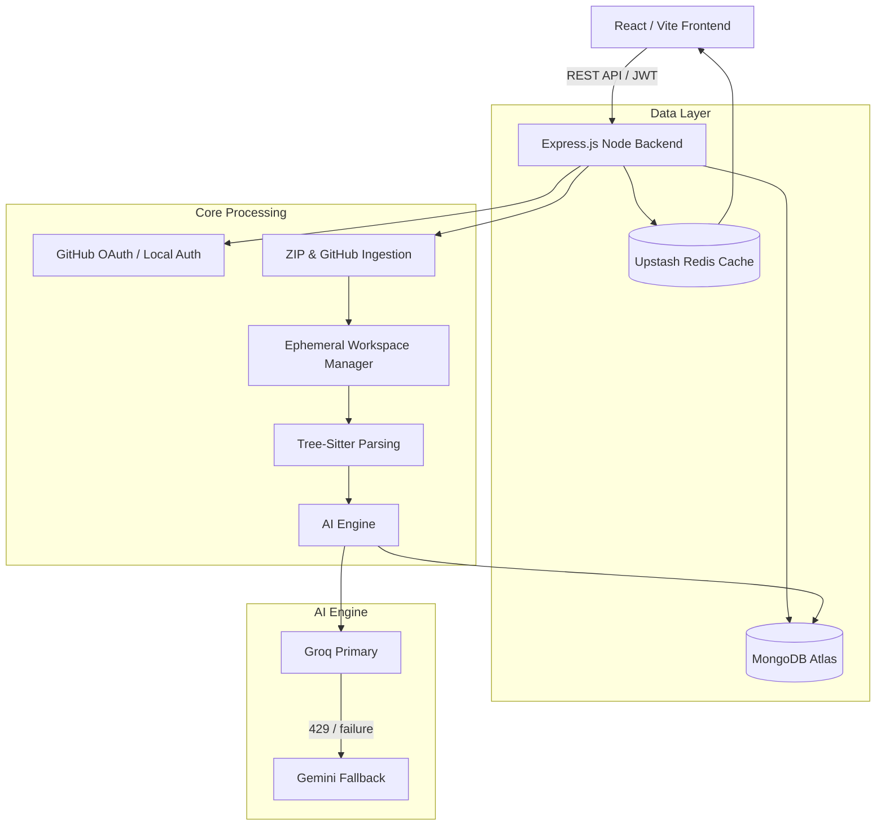
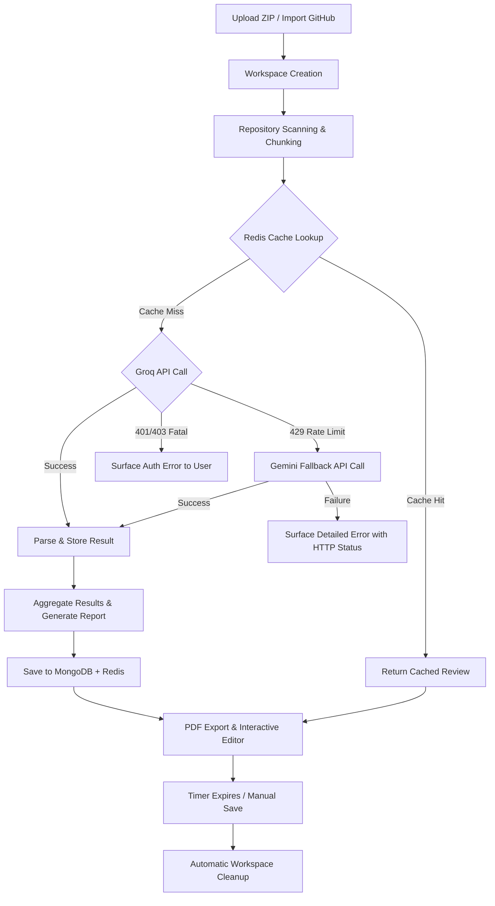

<div align="center">

# 🚀 AI Code Review & Analysis Platform

*An intelligent, automated code review and workspace lifecycle manager powered by AI.*

**[🚀 Live Demo](https://ai-code-review-1-9rkd.onrender.com)**

[](https://reactjs.org/)
[](https://vitejs.dev/)
[](https://nodejs.org/)
[](https://mongodb.com/)
[](https://upstash.com/)
[](https://groq.com/)

</div>

---

## 📖 Overview

The **AI Code Review Platform** is an enterprise-grade full-stack application designed to automate code analysis, security auditing, and refactoring suggestions. Built for developers, technical leads, and engineering teams, the platform seamlessly ingests codebases (via GitHub OAuth or ZIP uploads) and leverages large language models (LLMs) to provide instantaneous, cache-optimized feedback.

With a built-in interactive IDE, secure local workspace lifecycle management, automated report generation, and a resilient dual-provider AI engine (Groq → Gemini fallback), it bridges the gap between static analysis and human-level code review.

---

## ✨ Features

| Feature | Description |
|---------|-------------|
| 🤖 **Dual-Provider AI Engine** | Resilient review pipeline that tries Groq first and automatically falls back to Gemini on rate-limit (429) or provider failure — zero manual intervention required. |
| 📁 **Multi-Source Ingestion** | Seamlessly import repositories via one-click **GitHub OAuth** or manual **ZIP Archive Uploads**. |
| ⚡ **Redis Caching** | High-performance Upstash Redis integration caches review results, bypassing redundant AI calls and drastically reducing latency. |
| 🛡️ **Workspace Lifecycle** | Ephemeral, isolated local workspaces with a strict timer persistence system and automatic session expiration for maximum security. |
| 📊 **Review History & Dashboards** | Persistent MongoDB storage of historical reviews, allowing users to trace code quality improvements over time. |
| 🔍 **Rich Error Diagnostics** | Every LLM API failure logs the exact HTTP status code, provider error body, rate-limit headers, and `Retry-After` value to the terminal for instant root-cause analysis. |
| 📄 **PDF Report Export** | Dynamically generate downloadable, professional PDF reports (via `jsPDF`) summarizing AI review metrics and security flags. |
| 💾 **Download Updated Code** | Apply AI suggestions directly in the Monaco Editor and download the modified repository instantly. |
| 🔒 **Authentication & Security** | Robust JWT authentication, GitHub OAuth, Helmet security headers, CORS protection, and Express rate limiting. |
| 💻 **Responsive UI** | Beautiful, modern dashboard interface styled with Tailwind CSS v4 and dynamic Lucide React icons. |

---

## 🛠️ Tech Stack

### Frontend
- **Framework:** React 19 + Vite 8
- **Styling:** Tailwind CSS v4
- **State Management:** Redux Toolkit
- **Code Editor:** Monaco Editor (`@monaco-editor/react`)
- **Routing:** React Router v7
- **Utilities:** `jsPDF`, `jspdf-autotable`, `lucide-react`

### Backend
- **Server:** Node.js + Express
- **Database:** MongoDB (Mongoose)
- **Caching:** Upstash Redis
- **Authentication:** JWT (`jsonwebtoken`), Bcrypt, GitHub OAuth
- **Security:** `helmet`, `cors`, `express-rate-limit`
- **File Parsing:** `simple-git`, `jszip`, `tree-sitter`
- **AI Integration:**
  - **Groq** — via OpenAI-compatible Node SDK (`openai`) pointed at `https://api.groq.com/openai/v1`
  - **Gemini** — via `@google/generative-ai` SDK (automatic fallback provider)

---

## 🏛️ System Architecture



---

## 🔄 Core Workflow



---

## 🤖 AI Pipeline Details

The review pipeline (`reviewPipeline/index.js`) uses a **two-provider fallback strategy**:

### Provider Priority
1. **Groq** (primary) — low-latency inference
2. **Gemini** (automatic fallback) — triggered when Groq returns 429, exhausts all model candidates, or fails with a non-auth error

### Failure Handling
| HTTP Status | Groq Behaviour | Gemini Behaviour |
|---|---|---|
| `401 / 403` | Fatal — pipeline aborts, surfaces auth error | Fatal — pipeline aborts |
| `429` | Immediately triggers Gemini fallback | Skips to next model candidate |
| `404` | Skips to next model candidate | Skips to next model candidate |
| `503` | Skips to next model candidate | Skips to next model candidate |

### Error Logging
Every failed API call prints to the terminal:
```
────────────────────────────────────────────────────────────
❌ [Groq] Model "openai/gpt-oss-120b" API call FAILED
   HTTP Status  : 429
   Error Msg    : Rate limit exceeded
   Retry-After  : 30
   Rate-limit Headers: { "x-ratelimit-reset-requests": "30s" }
   Provider Error Body: { "error": { "type": "rate_limit_error" } }
────────────────────────────────────────────────────────────
```

### Active Models (verified against live API — 2026-08-18)
| Provider | Models (in priority order) |
|---|---|
| **Groq** | `openai/gpt-oss-120b` → `openai/gpt-oss-20b` → `qwen/qwen3.6-27b` |
| **Gemini** | `gemini-2.5-flash` → `gemini-2.5-flash-lite` → `gemini-3.5-flash` → `gemini-3.6-flash` |

---

## 📂 Folder Structure

```text
AI_CODE_REVIEW/
├── backend-node/
│   ├── src/
│   │   ├── middleware/         # Auth, Rate Limiter, Workspace Auth
│   │   ├── models/             # Mongoose Schemas (User, Repository, ReviewHistory)
│   │   ├── routes/             # Express API Endpoints (ai.js, auth, file, github, etc.)
│   │   ├── services/
│   │   │   ├── reviewPipeline/ # Core AI pipeline (scanner, chunker, LLM caller, aggregator)
│   │   │   ├── RedisCacheService.js
│   │   │   ├── StorageService.js
│   │   │   └── WorkspaceManager.js
│   │   └── index.js            # Backend Entry Point
│   └── package.json
├── frontend/
│   ├── src/
│   │   ├── components/         # UI Modules (FileExplorer, AiReviewPanel, QualityDashboard)
│   │   ├── contexts/           # Toast & Theme Contexts
│   │   ├── features/           # Redux Slices (authSlice, etc.)
│   │   ├── hooks/              # Custom React Hooks (useWorkspaceTimer)
│   │   ├── pages/              # Route Views (Login, Dashboard, GithubCallback)
│   │   ├── store/              # Redux Store Configuration
│   │   ├── utils/              # Helpers (PDF Generator)
│   │   └── App.jsx             # Frontend Router
│   ├── vite.config.js
│   └── package.json
├── .env.example
└── README.md
```

---

## 🚀 Installation & Setup

### Prerequisites
- Node.js (v18+)
- MongoDB cluster (Atlas or local)
- Upstash Redis database
- GitHub OAuth App (for Client ID & Secret)
- **Groq API Key** — from [console.groq.com](https://console.groq.com)
- **Gemini API Key** — from [aistudio.google.com](https://aistudio.google.com) *(must start with `AIza`)*

### 1. Clone the repository
```bash
git clone https://github.com/Abhirock73/AI_CODE_REVIEW.git
cd AI_CODE_REVIEW
```

### 2. Backend Setup
```bash
cd backend-node
npm install
```

### 3. Frontend Setup
```bash
cd frontend
npm install
```

### 4. Environment Variables
Copy `.env.example` to `.env` in the **root** directory and fill in the required values (see table below).

### 5. Start the Application
Start both servers in separate terminals:

**Backend:**
```bash
cd backend-node
npm start
```

**Frontend:**
```bash
cd frontend
npm run dev
```

---

## 🔐 Environment Variables

| Variable | Description | Required | Environment |
|----------|-------------|----------|-------------|
| `PORT` | Backend server port (Default: `5000`) | No | Backend |
| `MONGODB_URI` | MongoDB connection string | **Yes** | Backend |
| `REDIS_URI` | Upstash Redis connection string (`rediss://…`) | **Yes** | Backend |
| `JWT_SECRET` | Secret key for JWT signing | **Yes** | Backend |
| `GROQ_API_KEY` | API key for Groq (starts with `gsk_`) | **Yes** | Backend |
| `GEMINI_API_KEY` | API key for Google Gemini (starts with `AIza`) | **Yes** | Backend |
| `GITHUB_TOKEN` | Personal Access Token for private repo access | No | Backend |
| `GITHUB_CLIENT_ID` | GitHub OAuth App Client ID | **Yes** | Backend |
| `GITHUB_CLIENT_SECRET` | GitHub OAuth App Client Secret | **Yes** | Backend |
| `GITHUB_CALLBACK_URL` | GitHub OAuth Redirect URI | **Yes** | Backend |
| `FRONTEND_URL` | Allowed origin for CORS | **Yes** | Backend |
| `VITE_NODE_API_URL` | Base URL for backend API requests | **Yes** | Frontend |
| `VITE_GITHUB_CLIENT_ID` | Frontend GitHub OAuth Client ID | **Yes** | Frontend |

> **⚠️ Key Format Warning:** The Gemini API key must start with `AIza`. Keys starting with `AQ.` are OAuth tokens, not API keys, and will cause 401 errors. Get a valid key from [aistudio.google.com](https://aistudio.google.com).

---

## 🌐 API Overview

| Method | Endpoint | Description |
|--------|----------|-------------|
| `GET`  | `/api/health` | Application, Database, and Redis health status |
| `POST` | `/api/auth/github` | Authenticate user via GitHub OAuth callback |
| `POST` | `/api/repo/zip` | Upload and parse a ZIP codebase archive |
| `GET`  | `/api/github/repos` | List accessible repositories for authenticated user |
| `POST` | `/api/github/import` | Clone and ingest a selected GitHub repository |
| `POST` | `/api/ai/review-repo` | Trigger the full AI review pipeline (checks Redis cache first) |
| `POST` | `/api/ai/review-file` | Trigger a single-file AI review |
| `POST` | `/api/ai/chat` | Chat with AI about the repository |
| `GET`  | `/api/ai/review-progress/:id` | SSE stream for real-time pipeline progress |
| `GET`  | `/api/history` | Retrieve user's historical AI code reviews |
| `DELETE` | `/api/repo/:id/workspace` | Force cleanup of an active local workspace |

---

## ⚡ Performance & Security Optimizations

- **Upstash Redis Caching:** Drastically reduces external LLM API usage and costs. Identical code states return sub-second cached reviews.
- **Dual-Provider Fallback:** Groq → Gemini automatic failover ensures the pipeline succeeds even when one provider is rate-limited or unavailable.
- **Workspace Isolation & Ephemeral Storage:** User files are securely processed in fully isolated temporary directories. A robust `useWorkspaceTimer` React hook syncs with backend cron jobs to automatically purge orphaned or expired files, maintaining a zero-footprint architecture.
- **AST Parsing:** Leverages `tree-sitter` for precise, abstract-syntax-tree level code parsing before feeding context to the AI, filtering out irrelevant build artifacts and binaries.
- **Strict CORS & Rate Limiting:** Backend utilizes `helmet` for secure headers and `express-rate-limit` to prevent abuse of the AI generation endpoints.
- **SSE Progress Streaming:** Real-time pipeline status is streamed to the frontend via Server-Sent Events so users see chunk-by-chunk analysis progress.

---

## 🚢 Deployment

This application is configured for seamless deployment on **Render**.

1. **Static Site (Frontend):** Deploy the `/frontend` directory via Vite build step (`npm run build`). Ensure all `VITE_` environment variables are configured in the Render dashboard. Set routing rewrite rule `/*` → `/index.html` to support the SPA router.
2. **Web Service (Backend):** Deploy the `/backend-node` directory. Configure all environment variables in the Render dashboard. Start Command: `npm start`.

---

## 🔮 Future Improvements

- **WebSocket Integration:** Stream AI tokens in real-time to the frontend dashboard instead of awaiting the full LLM response.
- **Inline PR Comments:** Direct integration with GitHub's REST API to post AI review suggestions directly as Pull Request comments.
- **IDE Extensions:** Export the Monaco Editor logic into VS Code and JetBrains plugins.
- **Auto Model Discovery:** Dynamically query `/v1/models` at startup and update the model candidate list without requiring a redeploy.

---

## 📝 License

Distributed under the MIT License. See `LICENSE` for more information.

---

## 👨‍💻 Author

Built with ❤️ by a passionate engineer.

- **GitHub:** [@Abhirock73](https://github.com/Abhirock73)
