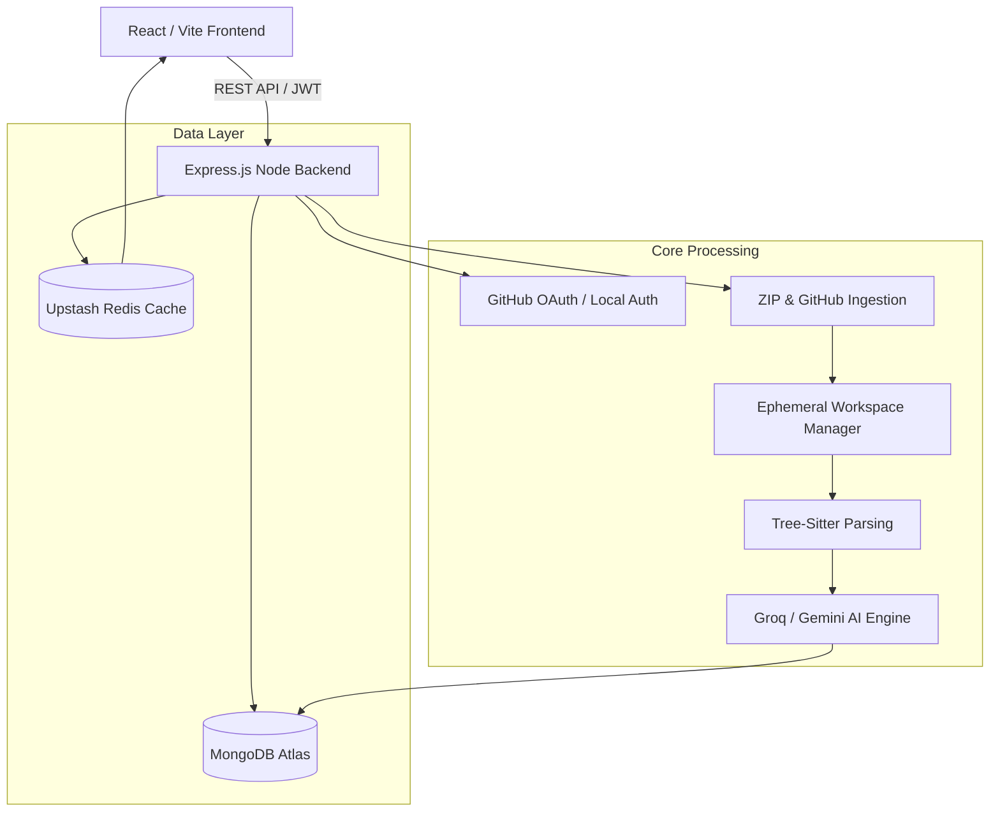
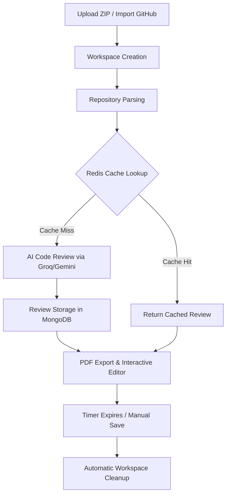

<div align="center">

# 🚀 AI Code Review & Analysis Platform

*An intelligent, automated code review and workspace lifecycle manager powered by AI.*

[](https://reactjs.org/)
[](https://vitejs.dev/)
[](https://nodejs.org/)
[](https://mongodb.com/)
[](https://upstash.com/)
[](https://groq.com/)

</div>

---

## 📖 Overview

The **AI Code Review Platform** is an enterprise-grade full-stack application designed to automate code analysis, security auditing, and refactoring suggestions. Built for developers, technical leads, and engineering teams, the platform seamlessly ingests codeframes (via GitHub OAuth or ZIP uploads) and leverages large language models (LLMs) to provide instantaneous, cache-optimized feedback. 

With a built-in interactive IDE, secure local workspace lifecycle management, and automated report generation, it bridges the gap between static analysis and human-level code review.

---

## ✨ Features

| Feature | Description |
|---------|-------------|
| 🤖 **AI Code Review** | Deep contextual analysis of codebases using Groq and Gemini APIs to identify security flaws, bugs, and refactoring opportunities. |
| 📁 **Multi-Source Ingestion** | Seamlessly import repositories via one-click **GitHub OAuth** or manual **ZIP Archive Uploads**. |
| ⚡ **Redis Caching** | High-performance Upstash Redis integration caches review results, bypassing redundant AI calls and drastically reducing latency. |
| 🛡️ **Workspace Lifecycle** | Ephemeral, isolated local workspaces with a strict timer persistence system and automatic session expiration for maximum security. |
| 📊 **Review History & Dashboards** | Persistent MongoDB storage of historical reviews, allowing users to trace code quality improvements over time. |
| 📄 **PDF Report Export** | Dynamically generate downloadable, professional PDF reports (via `jsPDF`) summarizing AI review metrics and security flags. |
| 💾 **Download Updated Code** | Apply AI suggestions directly in the Monaco Editor and download the modified repository instantly. |
| 🔒 **Authentication & Security** | Robust JWT authentication, GitHub OAuth, Helmet security headers, CORS protection, and Express rate limiting. |
| 💻 **Responsive UI** | Beautiful, modern dashboard interface styled with Tailwind CSS v4 and dynamic Lucide React icons. |

---

## 🛠️ Tech Stack

### Frontend
- **Framework:** React 19 + Vite 8
- **Styling:** Tailwind CSS v4
- **State Management:** Redux Toolkit
- **Code Editor:** Monaco Editor (`@monaco-editor/react`)
- **Routing:** React Router v7
- **Utilities:** `jsPDF`, `jspdf-autotable`, `lucide-react`

### Backend
- **Server:** Node.js + Express
- **Database:** MongoDB (Mongoose)
- **Caching:** Upstash Redis
- **Authentication:** JWT (`jsonwebtoken`), Bcrypt, GitHub OAuth
- **Security:** `helmet`, `cors`, `express-rate-limit`
- **File Parsing:** `simple-git`, `jszip`, `tree-sitter`
- **AI Integration:** OpenAI Node SDK (configured for Groq API endpoints)

---

## 🏛️ System Architecture



---

## 🔄 Core Workflow



---

## 📂 Folder Structure

```text
AI_CODE_REVIEW/
├── backend-node/
│   ├── src/
│   │   ├── middleware/      # Auth, Rate Limiter
│   │   ├── models/          # Mongoose Schemas (User, Repo, ReviewHistory)
│   │   ├── routes/          # Express API Endpoints (ai, auth, file, github, etc.)
│   │   ├── services/        # Redis Cache, AI Pipeline, Workspace Managers
│   │   └── index.js         # Backend Entry Point
│   └── package.json
├── frontend/
│   ├── src/
│   │   ├── components/      # UI Modules (FileExplorer, AiReviewPanel, QualityDashboard)
│   │   ├── contexts/        # Toast & Theme Contexts
│   │   ├── features/        # Redux Slices (authSlice, etc.)
│   │   ├── hooks/           # Custom React Hooks (useWorkspaceTimer)
│   │   ├── pages/           # Route Views (Login, Dashboard, GithubCallback)
│   │   ├── store/           # Redux Store Configuration
│   │   ├── utils/           # Helpers (PDF Generator)
│   │   └── App.jsx          # Frontend Router
│   ├── vite.config.js       # Vite Configuration
│   └── package.json
└── README.md
```

---

## 🚀 Installation & Setup

### Prerequisites
- Node.js (v18+)
- MongoDB cluster (Atlas or local)
- Upstash Redis database
- GitHub OAuth App (for Client ID & Secret)
- Groq/Gemini API Key

### 1. Clone the repository
```bash
git clone https://github.com/YourUsername/AI_CODE_REVIEW.git
cd AI_CODE_REVIEW
```

### 2. Backend Setup
```bash
cd backend-node
npm install
```

### 3. Frontend Setup
```bash
cd frontend
npm install
```

### 4. Environment Variables
Create a `.env` file in the root directory and fill in the required keys based on the table below.

### 5. Start the Application
Start both development servers concurrently or in separate terminal tabs:

**Backend:**
```bash
cd backend-node
npm run start
```

**Frontend:**
```bash
cd frontend
npm run dev
```

---

## 🔐 Environment Variables

| Variable | Description | Required | Environment |
|----------|-------------|----------|-------------|
| `PORT` | Backend server port (Default: 5000) | No | Backend |
| `MONGODB_URI` | MongoDB connection string | **Yes** | Backend |
| `REDIS_URI` | Upstash Redis connection string | **Yes** | Backend |
| `JWT_SECRET` | Secret key for JWT signing | **Yes** | Backend |
| `GROQ_API_KEY` | API Key for Groq AI Engine | **Yes** | Backend |
| `GEMINI_API_KEY` | API Key for Gemini AI Engine | **Yes** | Backend |
| `GITHUB_CLIENT_ID` | GitHub OAuth App Client ID | **Yes** | Backend |
| `GITHUB_CLIENT_SECRET`| GitHub OAuth App Client Secret | **Yes** | Backend |
| `GITHUB_CALLBACK_URL` | GitHub OAuth Redirect URI | **Yes** | Backend |
| `FRONTEND_URL` | Allowed origin for CORS | **Yes** | Backend |
| `VITE_NODE_API_URL` | Base URL for backend API requests | **Yes** | Frontend |
| `VITE_GITHUB_CLIENT_ID`| Frontend GitHub OAuth Client ID | **Yes** | Frontend |

---

## 🌐 API Overview

| Method | Endpoint | Description |
|--------|----------|-------------|
| `GET`  | `/api/health` | Application, Database, and Redis health status |
| `POST` | `/api/auth/github` | Authenticate user via GitHub OAuth callback |
| `POST` | `/api/repo/zip` | Upload and parse a ZIP codebase archive |
| `GET`  | `/api/github/repos` | List accessible repositories for authenticated user |
| `POST` | `/api/github/import` | Clone and ingest a selected GitHub repository |
| `POST` | `/api/ai/review` | Trigger an AI review pipeline (checks Redis cache first) |
| `GET`  | `/api/history` | Retrieve user's historical AI code reviews |
| `DELETE`| `/api/repo/:id/workspace` | Force cleanup of an active local workspace |

---

## ⚡ Performance & Security Optimizations

- **Upstash Redis Caching:** Drastically reduces external LLM API usage and costs. Identical code states return sub-second cached reviews.
- **Ephemeral Workspaces:** User files are processed in isolated temporary directories (`/tmp_workspace/`). A robust `useWorkspaceTimer` React hook syncs with backend cron jobs to automatically purge orphaned or expired files from the disk.
- **AST Parsing:** Leverages `tree-sitter` for precise, abstract-syntax-tree level code parsing before feeding context to the AI, filtering out irrelevant build artifacts and binaries.
- **Strict CORS & Rate Limiting:** Backend utilizes `helmet` for secure headers and `express-rate-limit` to prevent abuse of the AI generation endpoints.

---

## 🚢 Deployment

This application is configured for seamless deployment on **Render**.

1. **Static Site (Frontend):** Deploy the `/frontend` directory via Vite build step (`npm run build`). Ensure all `VITE_` environment variables are configured in the dashboard. Set routing rewrite rules `/*` to `/index.html` to support the SPA.
2. **Web Service (Backend):** Deploy the `/backend-node` directory. Configure environment variables and ensure the Start Command is `npm start`.

---

## 🔮 Future Improvements

- **WebSocket Integration:** Stream AI tokens in real-time to the frontend dashboard instead of awaiting the full LLM response.
- **Inline PR Comments:** Direct integration with GitHub's REST API to post AI review suggestions directly as Pull Request comments.
- **IDE Extensions:** Export the Monaco Editor logic into VS Code and JetBrains plugins.

---

## 📝 License

Distributed under the MIT License. See `LICENSE` for more information.

---

## 👨‍💻 Author

Built with ❤️ by a passionate engineer.

- **GitHub:** [@Abhirock73](https://github.com/Abhirock73)
